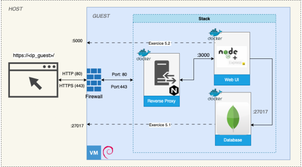
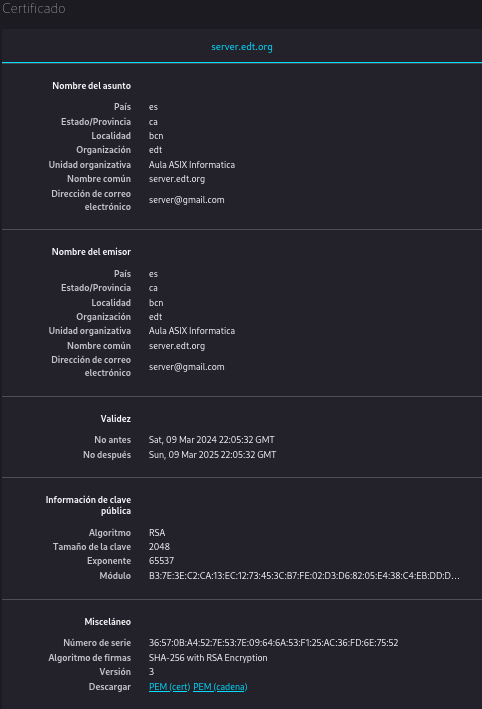
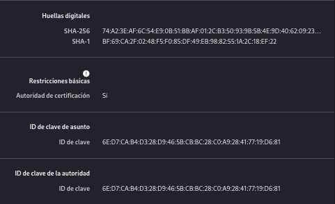

# Projecte2 2024-2025

## 2ASIX-M14



# PROJECTE 2 
INDEX
1. [INTRODUCCIÓ](#introduccio)
    - [Creació de la MV](#creacio_de_la_mv)
    - [Engegar MV](#engegar_mv)
    - [Partitions](#partitions)
    - [*Apaguem la màquina i activem el mode bridge*](#bridge)

2. [DESENVOLUPAMENT DEL PROJECTE](#dins_mv)
    - [Instal·lacions generals](#instal·lacions_generals)
    - [Instal·lació docker i docker-compose](#docker_dockercompose)
    - [MongoDB](#mongodb)
    - [Node](#node)
    - [Express/Node](#express_node)
    - [Certificat digital](#certificat_digital)
    - [Reverse-proxy](#reverse_proxy)
    - [Firewall](#firewall)

<br>

## <a name="introduccio"></a>INTRODUCCIÓ

Imatge ISO a utilitzar: <br>
[debian-12.5.0-amd64-netinst.iso](https://cdimage.debian.org/debian-cd/current/amd64/iso-cd/)

### <a name="creacio_de_la_mv"></a>Creació de la MV

*Skip unattended Installation*
Base Memory: 4000 MB 
Processor: 4 CPU's
Disk Size: 20 MB

*Settings*:
- Storage:
    - Storage Devices / Controller: SATA:
        - Add hard disk (segon símbol):
            - Create: 
                - VDI
                - Next
                - Finish
                - Choose
            (2 controller sata)
            - Ok

### <a name="engegar_mv"></a>Engegar MV

- Graphical Install
- Select a Language: English
- Select your location: other / Europe / Spain
- Configure locales: United States
- Keyboard Language: Spanish
- Hostname: debian
- Domain name: - 
- Root Password: jupiter
- Full name for the new user: guest
- Username for your account: guest
- User password: guest
- Configure the clock: Madrid

### <a name="partitions"></a>Partitions

- Manual 
    - Click al Primer espai de disc:
        - Yes
    - Click al Segon espai de disc:
        - Yes

    - Click al Primer disc:
        - Create a new partition:
            - Size: All
            - Primary
            - Use ass:
                - RAID
            - Done setting up the partition
    - Click al Segon disc:
        - *Lo mateix que hem fet al primer disc*
    
    - Configure software RAID:
        - Yes
        - Create MD device
        - RAID1
        - continue
        - continue
        - Seleccionem els dos
        - Finish
    - Click al disc RAID1
        - Use as: Ext4
        - Mount Point: / 
        - Done setting up the partition
    - Finish partitioning and write the changes to disk
        - No
        - Yes

- Configure the package manager:
    - No
    - United States
    - deb.debian.org
    - -
- Configuring popularity-contest:
    - No
- Software selection:
    - "Els que estiguin marcats per defecte"
- GRUB
    - Yes
    - Primer disc

### <a name="bridge"></a>Apaguem la màquina i activem el mode bridge

- Settings:
    - Network:
        - Adapter 1 / Attached to: NAT Network
<br>

## <a name="dins_mv"></a>DESENVOLUPAMENT DEL PROJECTE

Actualització dels repositoris

```bash
$ su -
root# apt-get update
```

### <a name="instal·lacions_generals"></a>Instal·lacions generals
```bash
root# apt-get install nmap sudo less vim tree iproute2 net-tools docker git
root# apt-get install systemctl
```
```bash
root# usermod -aG sudo guest
```
### <a name="docker_dockercompose"></a>Instal·lació docker i docker-compose

```bash
$ sudo apt-get install -y apt-transport-https ca-certificates curl gnupg lsb-release

$ curl -fsSL https://download.docker.com/linux/debian/gpg | sudo gpg --dearmor -o /usr/share/keyrings/docker-archive-keyring.gpg

$ echo "deb [signed-by=/usr/share/keyrings/docker-archive-keyring.gpg] https://download.docker.com/linux/debian $(lsb_release -cs) stable" | sudo tee /etc/apt/sources.list.d/docker.list > /dev/null

$ sudo apt-get update

$ sudo apt install -y docker-ce docker-ce-cli containerd.io

$ sudo usermod -aG docker guest

$ sudo curl -L "https://github.com/docker/compose/releases/latest/download/docker-compose-$(uname -s)-$(uname -m)" -o /usr/local/bin/docker-compose

$ sudo chmod +x /usr/local/bin/docker-compose
```

#### GITLAB CONFIG:

```bash
$ git config --global user.email "exemple@gmail.com"
$ git config --global user.name "nom-d’usuari"
```
IP MÀQUINA LOCAL: 10.200.243.221 
<br>
IP MAQUINA VIRTUAL: 10.200.243.143 

##### COMPROVACIONS

```bash
$ df -h 
```
```bash
$ cat /proc/mdstat 
```

##### LOCAL-REMOT

```bash
$ ping 10.200.243.221
```
##### REMOT-LOCAL

```bash
$ ping 10.200.243.143
```
Creació de les networks i del volume:
```bash
$ docker network create 2hisx
$ docker network create security
$ docker volume create  data-mongo
```
<br>

### <a name="mongodb"></a>Mongo DB

docker-compose.yml (MongoDB):

```bash
version: '3.6'

services:
  mongodb:
    image: mongo:7-jammy
    container_name: mongodb.edt.org
    hostname: mongodb.edt.org
    ports:
      - "27017:27017"
    volumes: 
      - "data-mongo:/var/lib/mongodb"
      - "./data-mongo.js:/docker-entrypoint-initdb.d/data-mongo.js"
    environment: 
      - MONGO_INITDB_ROOT_USERNAME=admin
      - MONGO_INITDB_ROOT_PASSWORD=jupiter
      - MONGO_INITDB_DATABASE=films
    command: --auth

volumes:
  data-mongo:
```

```bash
$ sudo docker compose up --build -d
$ docker ps
```
 
- Dins de la MV:

```bash
$ sudo netstat -a | grep 27017
```

- Fora de la MV:

```bash
$ nmap -p- --open -n 10.200.243.143
$ sudo docker compose down
```

##### GUIA D'INSTAL·LACIÓ MONGOSH:

```bash
$ sudo apt-get install gnupg curl

$ curl -fsSL https://pgp.mongodb.com/server-7.0.asc |sudo gpg  --dearmor -o /etc/apt/trusted.gpg.d/mongodb-server-7.0.gpg

$ echo "deb [ arch=amd64,arm64 ] https://repo.mongodb.org/apt/ubuntu jammy/mongodb-org/7.0 multiverse" | sudo tee /etc/apt/sources.list.d/mongodb-org-7.0.list

$ sudo apt-get update

$ sudo apt-get install -y mongodb-org

$ sudo systemctl start mongod

$ sudo systemctl enable mongod

$ mongosh
```

Comanda per entrar:
```bash
$ mongosh --host localhost -u admin -p --authenticationDatabase admin
jupiter
```
<br>

### <a name="node"></a>Node

docker-compose.yml (MongoDB + Node):

```bash
version: '3.6'

services:
  mongodb:
    image: mongo:7-jammy
    container_name: mongodb.edt.org
    hostname: mongodb.edt.org
    ports:
      - "27017:27017"
    volumes: 
      - "data-mongo:/var/lib/mongodb"
      - "./data-mongo.js:/docker-entrypoint-initdb.d/data-mongo.js"
    environment: 
      - MONGO_INITDB_ROOT_USERNAME=admin
      - MONGO_INITDB_ROOT_PASSWORD=jupiter
      - MONGO_INITDB_DATABASE=films
    command: --auth

  node:
    build: ./node-app
    container_name: node.edt.org
    ports:
      - "5000:3000"

volumes:
  data-mongo:

```

Dockerfile (node-app):

```Dockerfile
FROM node:20-alpine3.17

RUN mkdir -p /usr/src/app
RUN npm install

WORKDIR /usr/src/app
COPY * /usr/src/app

CMD node server.js
EXPOSE 3000
```

```bash
$ sudo docker compose up --build -d 
$ docker ps
```

Obrim un navegador qualsevol i introduim:

http://localhost:5000

Això obre la pàgina pero no veiem les pel·lícules


<br>

### <a name="express_node"></a>Express/Node

docker-compose.yml (MongoDB + Express/Node):

```bash
version: '3.6'

services:
  mongodb:
    image: mongo:7-jammy
    container_name: mongodb.edt.org
    hostname: mongodb.edt.org
    ports:
      - "27017:27017"
    volumes: 
      - "data-mongo:/var/lib/mongodb"
      - "./data-mongo.js:/docker-entrypoint-initdb.d/data-mongo.js"
    environment: 
      - MONGO_USERNAME=guest
      - MONGO_PASSWORD=guest
      - MONGO_DATABASE=films
      - MONGO_HOST=mongodb.edt.org
      - MONGO_PORT=27017
    networks:
      - 2hisx

  node:
    build: ./node-app
    container_name: node.edt.org
    environment: 
      - MONGO_USERNAME=guest
      - MONGO_PASSWORD=guest
      - MONGO_DATABASE=films
      - MONGO_HOST=mongodb.edt.org
      - MONGO_PORT=27017
    networks:
      - 2hisx
    ports:
      - "5000:3000"

volumes:
  data-mongo:

networks:
  2hisx:
```

```bash
$ sudo docker compose up --build -d
$ docker ps
$ sudo netstat -tulp | grep LISTEN
$ nmap -p- --open -n 10.200.243.143
```

http://localhost:5000

Ara, si entrem dins del link, veurem la pàgina web amb les pel·lícules
<br><br>

### <a name="certificat_digital"></a>Certificat digital
```bash
$ openssl req -x509 -nodes -days 365 -newkey rsa:2048 -keyout rproxy.key -out rproxy.crt 
```
Dockerfile (reverse-proxy):
```Dockerfile
FROM nginx

COPY nginx.conf /etc/nginx/nginx.conf
COPY rproxy.key /etc/nginx/rproxy.key
COPY rproxy.crt /etc/nginx/rproxy.crt

EXPOSE 80
EXPOSE 443
```
nginx.conf(reverse-proxy):

```bash
events {
    worker_connections 1024;
}


http {
  server {
    listen 80;
    server_name localhost;

    return 301 https://$host$request_uri;
  
  }


  server {
    listen 443 ssl;
    server_name localhost;

    ssl_certificate /etc/nginx/projectecert.crt;
    ssl_certificate_key /etc/nginx/projectekey.key;

    ssl_protocols TLSv1.2 TLSv1.3;
    ssl_prefer_server_ciphers on;

    location / {
        proxy_pass http://node:3000;
        proxy_http_version 1.1;
        proxy_set_header Upgrade $http_upgrade;
        proxy_set_header Connection 'upgrade';
        proxy_set_header Host $host;
        proxy_cache_bypass $http_upgrade;
    }
  }
}
```
<br/>

### <a name="reverse_proxy"></a>Reverse-proxy

docker-compose.yml (MongoDB + Express/Node + ReverseProxy):

```bash
version: '3.6'

services:
  mongodb:
    image: mongo:7-jammy
    container_name: mongodb.edt.org
    hostname: mongodb.edt.org
    ports:
      - "27017:27017"
    volumes: 
      - "data-mongo:/var/lib/mongodb"
      - "./data-mongo.js:/docker-entrypoint-initdb.d/data-mongo.js"
    environment: 
      - MONGO_USERNAME=guest
      - MONGO_PASSWORD=guest
      - MONGO_DATABASE=films
      - MONGO_HOST=mongodb.edt.org
      - MONGO_PORT=27017
    networks:
      - 2hisx

  node:
    build: ./node-app
    container_name: node.edt.org
    environment: 
      - MONGO_USERNAME=guest
      - MONGO_PASSWORD=guest
      - MONGO_DATABASE=films
      - MONGO_HOST=mongodb.edt.org
      - MONGO_PORT=27017
    networks:
      - 2hisx
      - security
    ports:
      - "5000:3000"
  
  reverse-proxy:
    build: ./reverse-proxy
    container_name: rproxy.edt.org
    depends_on:
      - node
    ports:
      - "80:80"
      - "443:443"
    networks:
      - security


volumes:
  data-mongo:

networks:
  2hisx:
  security:
```
```bash
$ sudo docker compose up --build -d 
$ docker ps
$ sudo netstat -a | grep http
```

#### LOCAL:
https://10.200.243.148
#### MV:
https://localhost


```bash
$ nc -znv 10.0.2.15 80
```

#### Comprovacions de la connexió als contenidors
```bash
$ docker network inspect 2hisx --format='{{json .Containers}}' | python3 -m json.tool
$ docker network inspect security --format='{{json .Containers}}' | python3 -m json.tool
```
- Accedir des d’un navegador del Host a la URL amb http (port 80) i comprovar que es
redirecciona a la https (port 443):

http://localhost (s'obre en mode segur https)

```bash
$ curl -l http://localhost
```

Depèn del buscador web fem Ctrl+i, seguretat, certificat:

<br>


Amb això veiem el nostre certificat
<br>
<br>

### <a name="firewall"></a>Firewall

Netejar totes les regles existents:
```bash
$ sudo iptables -F
```
Permetre connexions entrants als ports 80 i 443:
```bash
$ sudo iptables -A INPUT -p tcp --dport 80 -j ACCEPT
$ sudo iptables -A INPUT -p tcp --dport 443 -j ACCEPT
```
També provant cap a kick i twitch:
```bash
$ sudo iptables -A OUTPUT -p tcp -d kick.com --dport 443 -j REJECT
$ sudo iptables -A OUTPUT -p tcp -d www.twitch.tv --dport 443 -j REJECT
```

Bloquejar totes les altres connexions entrants:
```bash
$ sudo iptables -A INPUT -j DROP
```
```bash
$ nc -znv 10.0.2.15 80
$ sudo apt-get install -y iptables-persistent
root# iptables-save > /etc/iptables/rules.v4
$ curl -sSL -D - https://www.twitch.tv -o /dev/null
$ curl -sSL -D - https://kick.com  -o /dev/null
