# Projecte3 2024-2025

## 2ASIX-M14

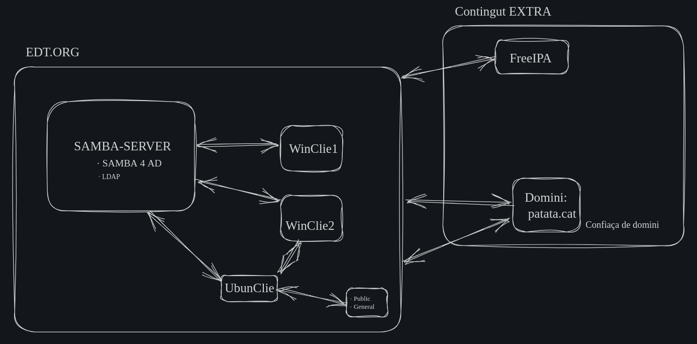

# PROJECTE 2 

INDEX
1. [INTRODUCCIÓ](#intro)
2. [SAMBA-SERVER](#samba-server)
    - [Instal·lació dels paquets](#instal·lació)
    - [IP estàtica](#ip-estatica)
    - [Afegir entrades al fitxer hosts](#hosts)
    - [Modificant el domini de cerca](#domini)
    - [Configuració SAMBA4 AD](#samba-config)
    - [Configuració de la sincronització de temps](#config-temps)
    - [Verificació](#verifi1)
    - [Altres comandes](#altres)
3. [WIN-CLIE1_2](#win_clie)
    - [Connexió windows al workgroup](#workgroup)
    - [Dins del SAMBA-SERVER](#dins)
    - [Verificació](#verifi2)
4. [UBUN-CLIE](#ubun)
    - [Instal·lació dels paquets](#instal·lació2)
    - [IP estàtica](#ip-estatica2)
    - [Afegir entrades al fitxer hosts](#hosts2)
    - [Configuració del sistema de resolució de noms](#switch)
    - [Canvi d'usuari SAMBA](#canvi-user)
5. [RECURSOS COMPARTITS](#recursos)
    - [Verificacions a ambes màquines](#comp_diverses)

<br>

## <a name="intro"></a>1-INTRODUCCIÓ

L'últim projecte trimestral té com a objectiu principal la implementació i administració d'una infraestructura informàtica integral a l'Escola del Treball de Barcelona (edt.org). Aquest projecte, desenvolupat en el marc del mòdul M14 d'Administració de Sistemes de Xarxes, amb màquines virtuals, abasta una àmplia gamma de coneixements i habilitats relacionades amb la gestió avançada de sistemes informàtics.

Durant el curs del projecte, es farà la implementació de tecnologies clau com SAMBA-4-AD i FreeIPA per a la integració de sistemes heterogenis i la gestió eficient d'identitats. A més, s'exploraran conceptes avançats com la federació d'identitats i la delegació de dominis per millorar l'escalabilitat i la flexibilitat de la infraestructura informàtica.

## <a name="samba-server"></a>2-SAMBA-SERVER

Imatge ISO a utilitzar:
[ubuntu-24.04-live-server-amd64.iso](https://ubuntu.com/download/server?gad_source=1&gclid=Cj0KCQjw0MexBhD3ARIsAEI3WHIErSSDFXRXnl9cY7JBd5Lk99Zqv3PEGL9oGv4SUBZsd27m0F42Q9oaAs2QEALw_wcB)


La mv **SAMBA-SERVER** estarà composta de 3 interfícies:

· **Adapter1**: NAT<br>
· **Adapter2**: Xarxa Interna<br>
· **Adapter3**: Adaptador de Pont<br>

També amb aquestes característiques:

· **Memoria RAM**: 2040 ram<br>
· **Processadors**: 4 cpus<br>
· **Usuari**: administrador<br>
· **Contrasenya**: admin<br>
<br></br>
### <a name="instal·lació"></a>Instal·lació dels paquets

Ens quedem sempre amb **root**:
```bash
sudo su
```
Actualitzem el repositoris:
```bash
apt-get update
```
Instal·lem els paquets necessaris:
```bash
apt-get install -y vim acl attr samba samba-dsdb-modules samba-vfs-modules smbclient winbind libpam-winbind libnss-winbind libpam-krb5 krb5-config krb5-user dnsutils chrony net-tools
    EDT.ORG
    sambac.edt.org
    sambac.edt.org
```
Configurem en nostre hostname (si volem) i verifiquem:
```bash
hostnamectl set-hostname sambac #o el posem al /etc/hostname
hostname -f
```
<br></br>
### <a name="ip-estatica"></a>IP estàtica
Afegim una IP estatica modificant el fitxer **00-installer-config.yaml**:
```bash
vim /etc/netplan/00-installer-config.yaml
```
```bash
network:
  ethernets:
    enp0s3:
      dhcp4: true
    enp0s8:
      dhcp4: false
      addresses: [192.168.1.10/24]
      gateway4: 192.168.1.1
      nameservers:
        addresses: [8.8.8.8, 8.8.4.4]
  version: 2
```
Apliquem els canvis:
```bash
netplan apply
```
<br></br>
### <a name="hosts"></a>Afegir entrades al fitxer hosts
Afegim al fitxer hosts les següents entrades:
```bash
vim /etc/hosts
```
```bash
192.168.1.10 sambac sambac.edt.org
192.168.1.10 edt.org edt
```

Per no tindre inconvenients:
```bash
systemctl disable -–now systemd-resolved
```
<br></br>
### <a name="domini"></a>Modificant el domini de cerca
```bash
unlink /etc/resolv.conf
```
Editem el fitxer **resolv.conf**:
```bash
vim /etc/resolv.conf
```
```bash
nameserver 192.168.1.10
nameserver 8.8.8.8
search edt.org
```
Tornem immutable el fitxer, és a dir, no es pot modificar, ni suprimir, ni reanomenar, ni canviar els seus permisos. Així no serà alterat:
```bash
chattr +i /etc/resolv.conf
```
Desactivem i aturem els serveis del servidor de fitxers Samba, el servidor de noms NetBIOS  i el servei de vinculació amb el domini de Samba. Això significa que els serveis no s'iniciaran automàticament en l'arrencada del sistema:
```bash
systemctl disable --now smbd nmbd winbind
```
Habilitem el servei Samba Active Directory:
```bash
systemctl unmask samba-ad-dc
systemctl enable samba-ad-dc
```
<br></br>
### <a name="samba-config"></a>Configuració SAMBA4 AD
Fem una copia de seguretat per si de cas:
```bash
mv /etc/samba/smb.conf /etc/samba/smb.conf.cp
```
```bash
samba-tool domain provision
Realm: Enter (EDT.ORG)
Domain: Enter (EDT)
Server Role: Enter (dc)
DNS backend: Enter (SAMBA_INTERNAL)
DNS forwarder: 8.8.8.8 #o 192.168.1.10 (la que ens mostra per defecte)
Password: 1212jupiter@
```
Fem una altre copia de seguretat de la configuració predeterminada del **Kerberos**:
```bash
mv /etc/krb5.conf /etc/krb5.conf.cp
```
Reemplaçar amb l'arxiu **/var/lib/samba/private/krb5.conf**:
```bash
cp /var/lib/samba/private/krb5.conf /etc/krb5.conf
```
Iniciarlitzar el servei Samba Active Directory:
```bash
systemctl start samba-ad-dc
systemctl status samba-ad-dc
```
<br></br>
### <a name="config-temps"></a>Configuració de la sincronització de temps
Samba Active Directory depèn del protocol Kerberos, i el protocol Kerberos requereix que els temps del servidor AD i de l'estació de treball estiguin sincronitzats. Per garantir una sincronització de temps adequada, també caldrà configurar un servidor de Protocol de Temps de Xarxa (NTP) en Samba. Els beneficis de la sincronització de temps d'AD inclouen la prevenció d'atacs de repetició i la resolució de conflictes de replicació d'AD.

Canviem els permisos i les propietats predeterminades del directori **/var/lib/samba/ntp_signd/ntp_signed**. El usuari/grup **chrony** cal que tingui permís de lectura al directori **ntp_signed**:
```bash
chown root:_chrony /var/lib/samba/ntp_signd/
chmod 750 /var/lib/samba/ntp_signd/
```

Modifiquem afegint a l'arxiu de configuració **/etc/chrony/chrony.conf** per habilitar el servidor NTP de chrony i apuntar a la ubicació del socket NTP a **/var/lib/samba/ntp_signd**:
```bash
vim /etc/chrony/chrony.conf
```
```bash
leapsectz right/UTC
bindcmdaddress 192.168.1.10
allow 192.168.1.0/24
ntpsigndsocket /var/lib/samba/ntp_signd
```
Reiniciem i verifiquem el servei chronyd:
```bash
systemctl restart chronyd
systemctl status chronyd
```
<br></br>
### <a name="verifi1"></a>Verificació
Verifiquem els dominis:
```bash
host -t A sambac.edt.org
host -t A edt.org
```
Verifiquem que els registres de servei Kerberos i LDAP apuntin al FQDN del nostre servidor:
```bash
host -t SRV _kerberos._udp.edt.org
host -t SRV _ldap._tcp.edt
```
```bash
smbclient -L edt.org
  - admin
```
```bash
kinit administrator@EDT.ORG
  - 1212jupiter@

klist
```
Iniciem sessió al servidor a través de SMB:
```bash
smbclient //localhost/netlogon -U 'administrator'
  - 1212jupiter@
  - ls
```
Per si volem canviar la contrasenya de l'administrador en cas que se'ns oblidi:
```bash
samba-tool user setpassword administrator
```
Podem verificar la integritat de l'arxiu de configuració de Samba:
```bash
testparm
```
Verifiquem el funcionament WINDOWS AD DC 2008:
```bash
samba-tool domain level show
```
Creem un par d'usuaris SAMBA:
```bash
samba-tool user create diego01
diego01@

samba-tool user create bryan01
bryan01@
```
<br></br>
### <a name="altres"></a>Altres comandes
Altres comandes que poden ser necessaries
<br></br><br></br>
Listar usuaris SAMBA:
```bash
sudo samba-tool user list
```
Eliminar usuaris SAMBA:
```bash
samba-tool user delete <nom_user>
```
Listar dispositius:
```bash
samba-tool computer list
```
Eliminar dispositius:
```bash
samba-tool computer delete <nom_pc>
```
Crear grups:
```bash
samba-tool group add <nom_grup>
```
Listar grups:
```bash
samba-tool group list
```
Listar els usuaris d'un grup:
```bash
samba-tool group listmembers 'Domain Admins'
```
Afegir usuaris a un grup:
```bash
samba-tool group addmembers <nom_grup> <nom_user>
```
Eliminar usuaris d'un grup:
```bash
samba-tool group removemembers <nom_grup> <nom_user>
```

## <a name="win_clie"></a>3-WIN-CLIE1_2
Imatge ISO a utilitzar:
[Win10_23H2_es-es_x64.iso](https://www.microsoft.com/es-es/software-download/windows10)

Podem configurar 2 clients Windows. Tots dos seguiran el mateix procediment
<br></br><br></br>
La mv **WIN-CLIE1_2** estarà composta de 2 interfícies:

· **Adapter1**: Xarxa Interna<br>
· **Adapter2**: Adaptador de Pont<br>

També amb aquestes característiques:

· **Memoria RAM**: 4080 ram<br>
· **Processadors**: 4 cpus<br>
· **Usuari**: WINCLIE<br>
· **Contrasenya**: 1212jupiter@<br>

Després d'instal·lar-lo, accedim a l'emmagatzematge (al virtuabox) i eliminem el disc:
<br><br><br>
*Configuració*
  - Xarxa i Internet, Ethernet
    - Xarxa 3
      - Comfiguració d'IP
        - editar

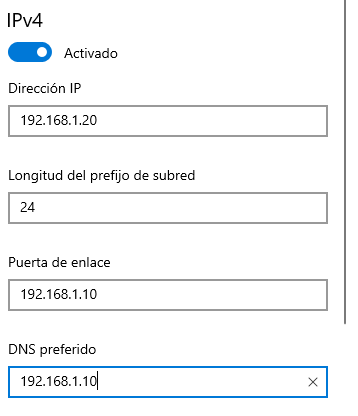

El podem fer si entrem al PowerShell també:
```powershell
interface ipv4 set address "Ethernet" static 192.168.1.20 255.255.255.0 192.168.1.10

interface ipv4 set dns "Ethernet" static 192.168.1.10
```
Comprovacions:
```powershell
ipconfig /all

ping 192.168.1.10
```
<br></br>
### <a name="workgroup"></a>Connexió cap al workgroup
*Configuració*
  - comptes
    - obtindre accessos al treball o escola
      - Connectar
        - Acció alternativa
          - EDT.ORG
            - administrator
            - 1212jupiter@
              - administrator
              - administrador

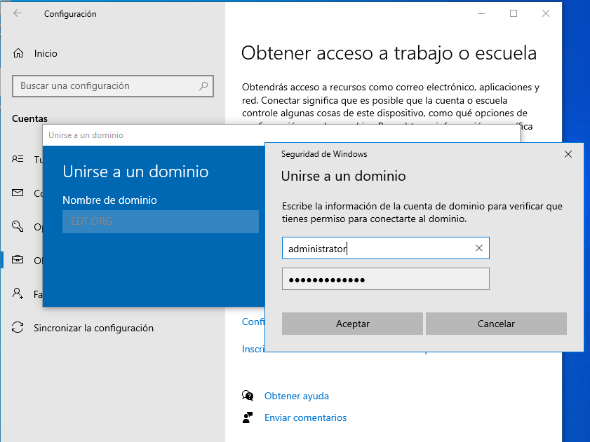

*Reiniciem*
Iniciem sessió amb l'usuari administrador:

- administrator/EDT.ORG
  - 1212jupiter@
<br></br>
<br></br>
### <a name="dins"></a>Dins del SAMBA-SERVER
Al **SAMBA-SERVER** comprovem que surt la màquina:
```bash
samba-tool computer list
```
Editem el **smb.conf**:
```bash
vim /etc/samba/smb.conf
```
```bash
[public]
        comment = share public
        path = /var/lib/samba/public
        browseable = yes
        writable = yes 
        guest ok = yes 
[global]
        dns forwarder = 192.168.1.10
        netbios name = SAMBAC
        realm = EDT.ORG
        server role = active directory domain controller
        workgroup = EDT
[sysvol]
        path = /var/lib/samba/sysvol
        read only = no

[netlogon]
        path = /var/lib/samba/sysvol/edt.org
        read only = no
```
Comprovació:
```bash
mkdir /var/lib/samba/public

touch /var/lib/samba/public/pub{0..3]}.txt
```
<br></br>
### <a name="verifi2"></a>Verificació
En el WIN-CLIE verifiquem:<br></br>
<br></br>
*Arxius*
  - \\\192.168.1.10
    - administrator
    - 1212jupiter@
      - public
        - pub0.txt
        - pub1.txt
        - pub2.txt
        - pub3.txt

## <a name="ubun"></a>4-UBUN-CLIE
Imatge ISO a utilitzar:
[ubuntu-24.04-desktop-amd64.iso](https://ubuntu.com/download/desktop)

La mv **UBUN-CLIE** estarà composta de 1 interficie:

· **Adapter1**: Adaptador de Pont<br>

Després el treurem i camviem el adapter:

· **Adapter1**: Xarxa Interna<br>

També té aquestes característiques:

· Memoria RAM: 2040 ram<br>
· Processadors: 2 cpus<br>
· Usuari: ubun-clie<br>
· Contrasenya: jupiter
<br></br>
### <a name="instal·lació2"></a>Instal·lació dels paquets
Ens quedem sempre amb root:
```bash
sudo su
```
Actualitzem el repositoris:
```bash
apt-get update
```
Instal·lem els recursos necessaris:
```bash
apt-get install -y vim acl attr samba samba-dsdb-modules  amba-vfs-modules smbclient winbind libpam-winbind libnss-winbind libpam-krb5 krb5-config krb5-user dnsutils chrony net-tools ntpdate
    EDT.ORG
    sambac.edt.org
    sambac.edt.org
```
<br></br>
Fem el canvi del **Adapter1**:

Adapter1: Xarxa Interna
<br></br>
### <a name="ip-estatica2"></a>IP estàtica
Canviem a una IP estàtica:

IP: 192.168.1.30<br></br>
MX: 255.255.255.0<br></br>
GATEWAY: 192.168.1.10<br></br>
DNS: 192.168.1.10<br></br>

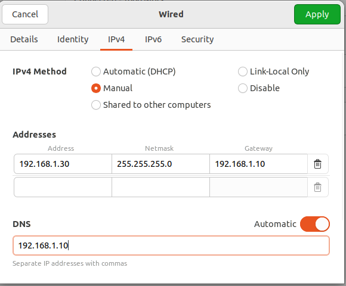

<br></br>
### <a name="hosts2"></a>Afegir entrades al fitxer hosts
Afegim al fitxer hosts les següents entrades:
```bash
vim /etc/hosts
```
```bash
192.168.1.10 sambac sambac.edt.org
192.168.1.10 edt.org edt
```
Autentiquem amb Kerberos:
```bash
kinit administrator@EDT.ORG
  - 1212jupiter@
```
Comprovacions:
```bash
ping edt.org

hostname -f

klist
```
<br></br>
Fem una copia de seguretat per si de cas:
```bash
mv /etc/samba/smb.conf /etc/samba/smb.conf.cp
```
Editem el fitxer **smb.conf** establint diversos valors clau per a la integració del servidor amb el domini EDT.ORG i altres configuracions relatives a la gestió dels usuaris i dels recursos:
```bash
vim /etc/samba/smb.conf
```
```bash
[global]
        workgroup = EDT
        realm = EDT.ORG
        netbios name = ubun-clie
        security = ADS 
        dns forwarder = 192.168.1.10

idmap config * : backend = tdb 
idmap config * : range = 50000-100000

        template homedir = /home/%D/%U
        template shell = /bin/bash
        winbind use default domain = true
        winbind offline logon = false
        winbind nss info = rfc2307
        winbind enum users = yes
        winbind enum group = yes

        vfs objects = acl_xattr
        map acl inherit = Yes 
        store dos  attributes = Yes
```
Aturem el controlador de domini de Samba i reiniciem els serveis smbd i nmbd, a més d'assegurar-nos que 'iniciïn automàticament en l'arrencada del sistema:
```bash
systemctl stop samba-ad-dc

systemctl restart smbd nmbd 
systemctl enable smbd  nmbd
```
Ens autentiquem amb el domini i realitzar la unió del servidor del domini:
```bash
net ads join -U administrator
 - 1212jupiter@ 
```
Al **SAMBA-SERVER** comprovem que surt la màquina:
```bash
samba-tool computer list
```
<br></br>
### <a name="switch"></a>Configuració del sistema de resolució de noms
Determinarem l'ordre de prioritat en què el sistema consulta les diferents fonts d'informació per a les bases de dades de noms:
```bash
vim /etc/nsswitch.conf

passwd:           compat winbind
group:            compat winbind
shadow:           compat winbind
gshadow:          files  systemd

hosts:            files dns
networks:         files

protocols:        db files
services:         db files sss
ethers:           db files
rpc:              db files

netgroup:         nis sss
automount:        sss
```
Reiniciem el servei:
```bash
systemctl restart winbind
```
Comprovem:
```bash
wbinfo -u
wbinfo -g

getent passwd | grep administrator
getent group | grep "domain admins"

id administrator
```
Actualitzem la configuració dels mòduls de l'autenticació PAM al sistema:
```bash
pam-auth-update
```
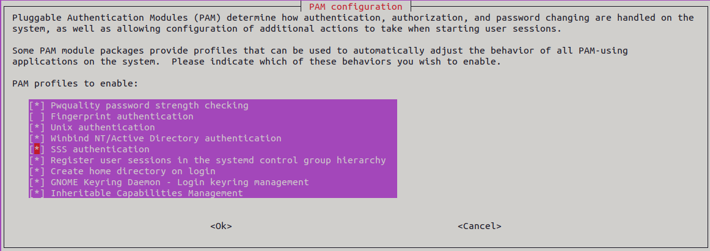

Configurem el fitxer **common-account** perquè, cada vegada que un usuari inicia sessió, es creï el seu directori d'inici utilitzant els paràmetres del **skel**, establint els permisos per defecte als directoris:
```bash
vim /etc/pam.d/common-account
```
```bash
session	required	pam_mkhomedir.so	skel=/etc/skel/	umask=0022
```
Permetem que l'usuari administrador tingui permisos de sudo i després comprovem que l'usuari **diego01**, en aquest cas, té el seu directori d'inici creat:
```bash
usermod -aG sudo administrator

su administrator
 - 1212jupiter@

sudo su
su - diego01
 - diego01*
ls
```
<br></br>
### <a name="canvi-user"></a>Canvi d'usuari SAMBA

Iniciem la sessió com a l'usuari **administrador** del domini **EDT.ORG**:

Compte: diego01@EDT.ORG<br></br>
Contrasenya: diego01*

Un cop iniciada la sessió com a l'usuari **diego01**, podem comprovar si el seu directori d'inici ha estat creat:

Comprovem:<br></br>
<br></br>
*computer*
  - home
    - EDT
      - administrator
      - diego01

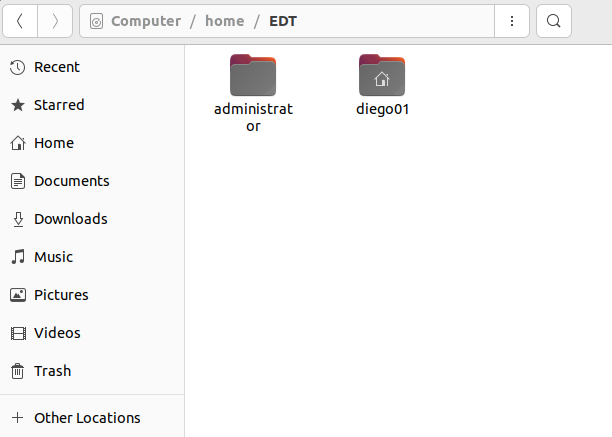

<br></br>
## <a name="recursos"></a>5-RECURSOS COMPARTITS
Dins del **SAMBA-SERVER** creem una carpeta on es creearan els recursos compartits del **diego01**:
```bash
mkdir /etc/diego01
chmod 777 /etc/dieg01
```
Afegim el recurs compartit per a diego01
```bash
vim /etc/samba/smb.conf
```
```bash
[diego01]
         comment = share per a diego01
         path = /etc/diego01
         valid users = diego01
         writable = yes
```
Fem restart del servei per aplicar els canvis:
```bash
systemctl restart samba-ad-dc
```
<br></br>
### <a name="comp_diverses"></a>VERIFICACIONS A AMBES MÀQUINES
Des del **WIN-CLIE** entrarem amb un altre usuari el recurso compartir del **diego01** i veurem que no tenim access:

*Arxius*
  - \\\192.168.1.10
    - diego01
      - bryan01
      - bryan01*
       - accés denegat

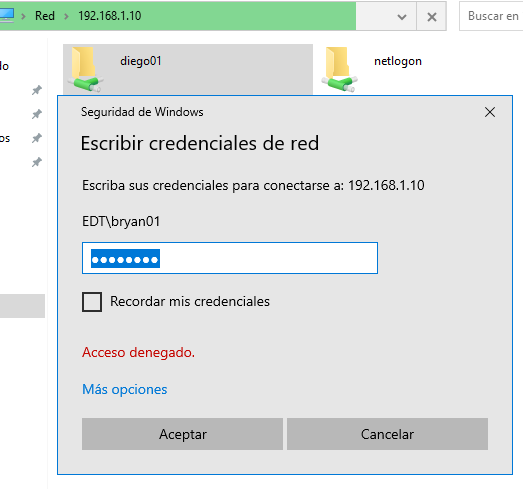

I amb també podem comprovar que amb l'usuari **bryan01** si pugui entrar al repositori i pujar el seus fitxers:

```bash
vim /etc/samba/smb.conf
```
```bash
[diego01]
         comment = share per a diego01
         path = /etc/diego01
         browseable = yes
         writable = yes
         valid users = bryan01, diego01
```
```bash
systemctl restart samba-ad-dc
```
<br></br>
Des del **WIN-CLIE**:<br></br>
<br></br>
*Arxius*
  - \\\192.168.1.10
    - diego01
      - bryan01
      - bryan01*
       - Nou / Document de text
       - deures_pendent.txt

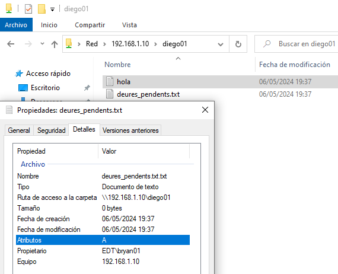
<br></br>
<br></br>
Des del **SAMBA-SERVER**:
```bash
su - bryan01
touch hola.txt
```
```bash
smbclient -U bryan01 //localhost/diego01
put hola.txt README.md 
ls
```

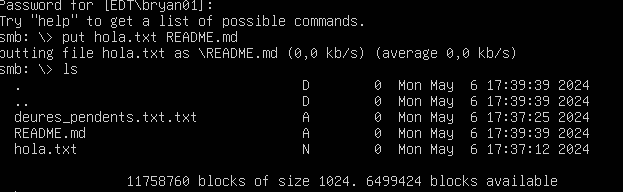
<br></br>
<br></br>
I per últim farem que un altre usuari no pugui ficar fitxers dins del repositori de **diego01**:
```bash
vim /etc/samba/smb.conf
```
```bash
[diego01]
        comment = share per a diego01
        path = /etc/diego01
        browseable = yes
        read only = yes
        write list = bryan01, diego
```
```bash
systemctl restart samba-ad-dc
```
samba-tool user create hacker01
 - hacker01@

<br></br>
Des del **UBUN-CLIE**:
```bash
su - hacker01
 - hacker01@
touch troyan.txt
```
```bash
smbclient -U hacker01 //localhost/diego01
  - put troyan.txt broma.txt 
  - NT_STATUS_ACCESS_DENIED opening remote file \broma.txt
```
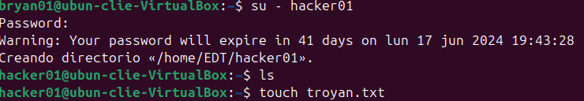
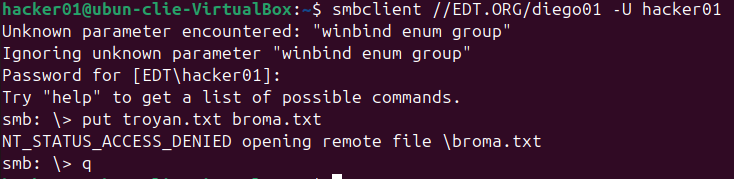

